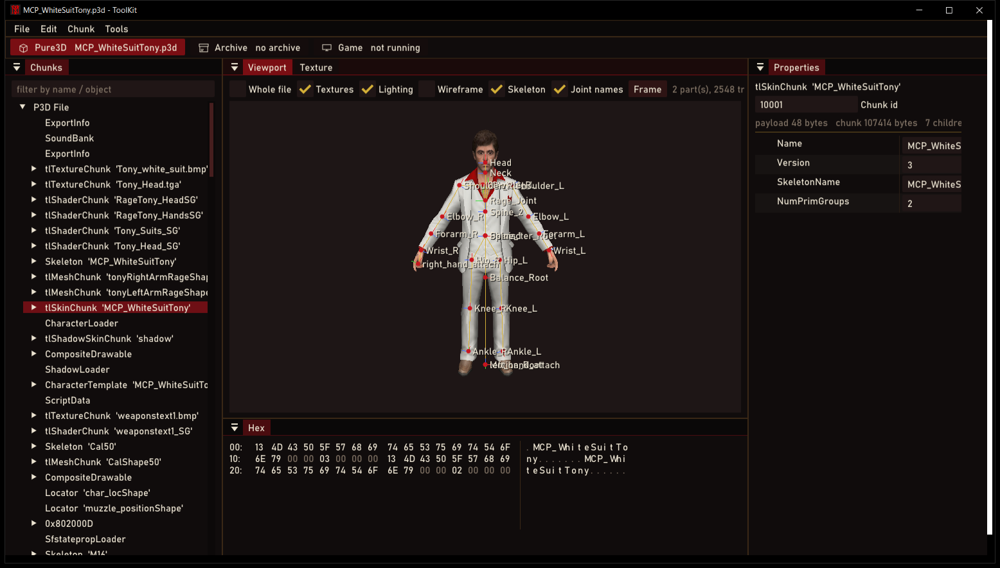
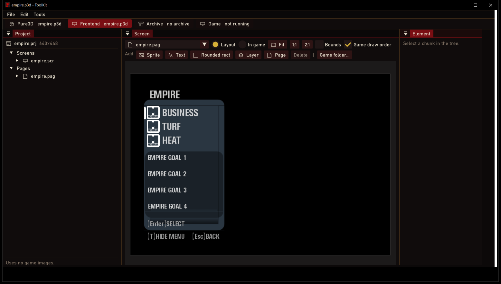
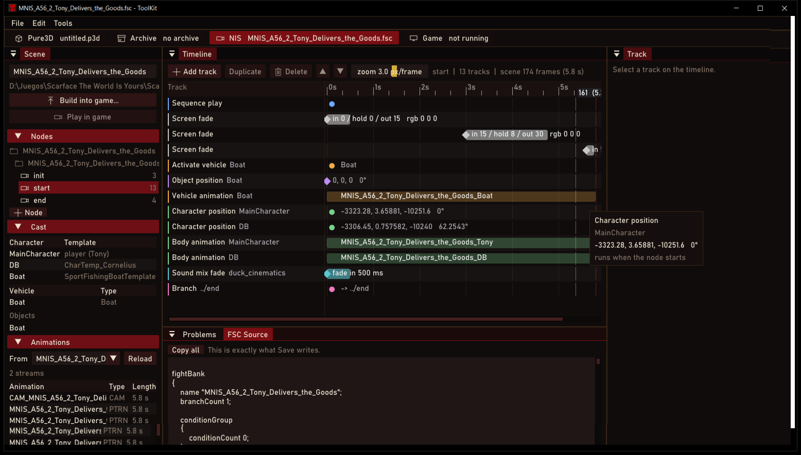

# ToolKit

Modding toolkit for Scarface: The World Is Yours (PC).

| Workspace | What it does |
|---|---|
| Pure3D | Opens and edits `.p3d` files: chunk tree, properties, hex view, textures and a 3D viewport. Imports your own models as characters on the game's skeleton. |
| Frontend | Shows the menus and HUD (`frontend/*.p3d`) as the game draws them; move, edit and multi-select elements. |
| Archive | Browses `.rcf` archives: extract, add, replace and rebuild. Plays the sounds inside and shows their original names. Files opened from an archive save back into it. |
| Game | Inspects the running game's menus and HUD, live. |
| NIS | Edits cutscenes (`art/nis/fsc/*.fsc`) on a timeline. |

## What's new

- Archive: play sounds (`.rsd`, `.wav`, `.ogg`) with Space or right click, and search them by their original name.
- Archive: saving a file opened from an archive writes it back into the `.rcf`.
- Frontend: select several elements with Ctrl+click and move them together.
- Save notifications, and the title bar shows the full path of the open file.

## Screenshots

| | |
|---|---|
|  |  |
| Pure3D: Tony with his skeleton | Character import: a custom model on the game's skeleton |
|  |  |
| Frontend: the Empire menu | Frontend: the street vendor |
|  |  |
| Frontend: blackjack | NIS: a cutscene timeline |

## Installation

1. Download [ToolKit.zip](https://github.com/GangstaTeam/ToolKit/releases/latest/download/ToolKit.zip).
2. Extract it anywhere and run `ToolKit.exe`.
3. For the Game workspace, copy `plugins/ToolKitLink.asi` into the game's `plugins` folder.

> [!NOTE]
> The Game workspace needs the v1.00.2 game executable and an ASI loader.
